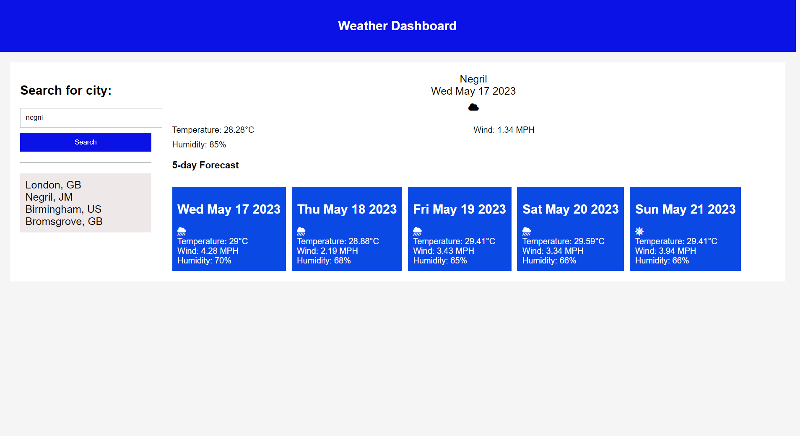

# 5-Day Forecast Weather Dashboard
This is a 5-day forecast weather dashboard application that allows users to check the weather forecast for a specific location. It utilizes HTML, CSS, and JavaScript to provide an interactive and user-friendly experience.

# Features
1. 5-day forecast: Users can view the weather forecast for the next five days, including temperature, humidity, wind speed, 
2. Search functionality: Users can search for a specific location to retrieve the weather forecast.
3. Recent search history locations should be saved.

# Technologies Used
This weather dashboard application was created using HTML, CSS, and JavaScript.
# Usage
Open the application in your web browser.

Enter the name of a location in the search bar.

Press Enter or click the search button.

The weather forecast for the next five days for the specified location will be displayed.

# Credits
This project was created by [Daley Jones].
Link to my weather Dashboard https://daleyjones.github.io/sever-side-week6/
 

# License
This project is licensed under the MIT License - see the LICENSE.md file for details.